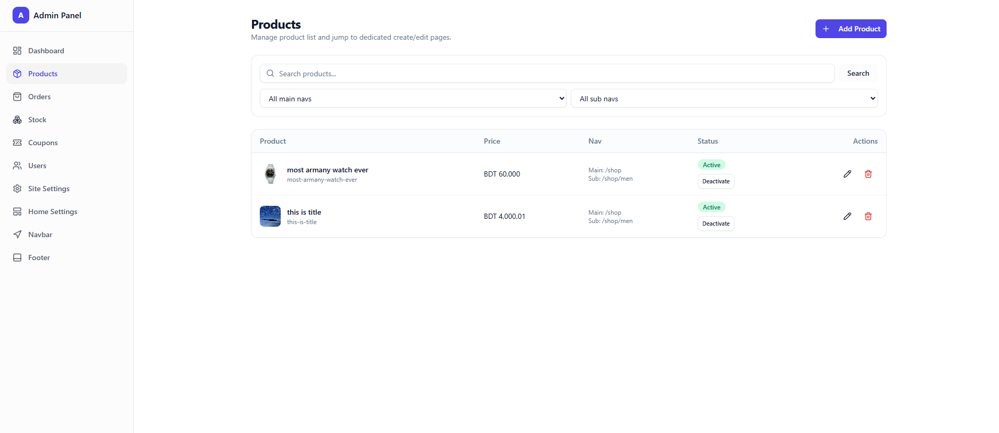
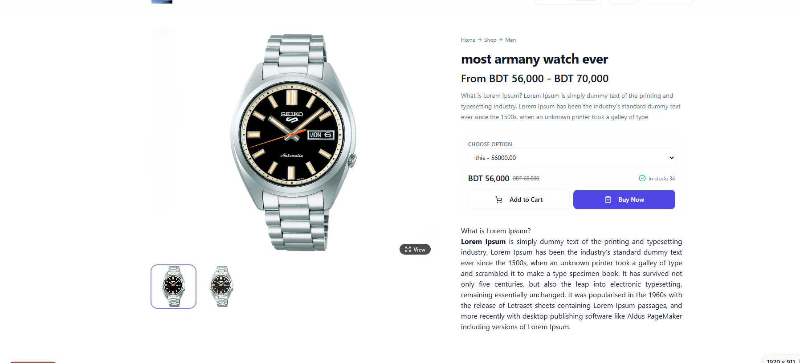
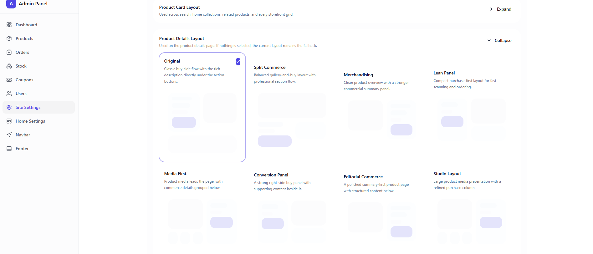
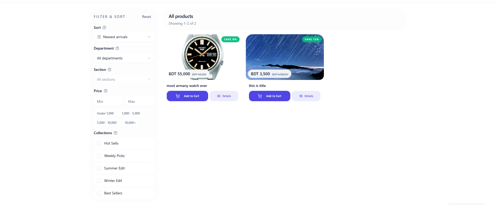
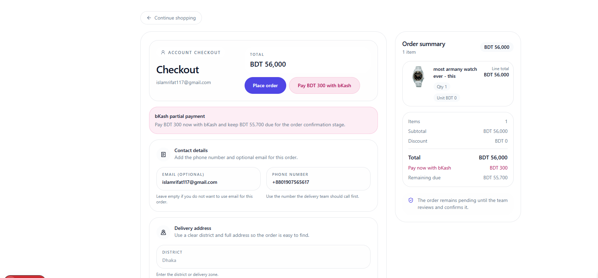
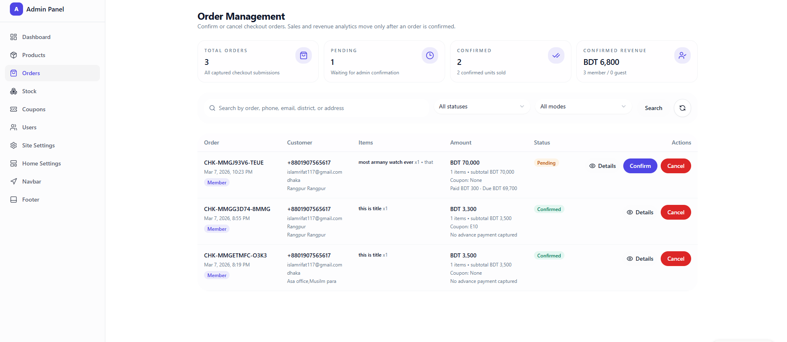
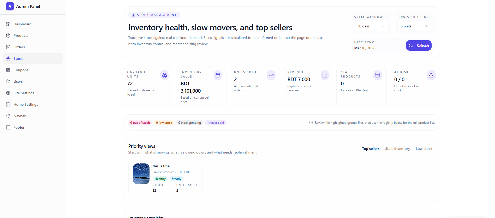
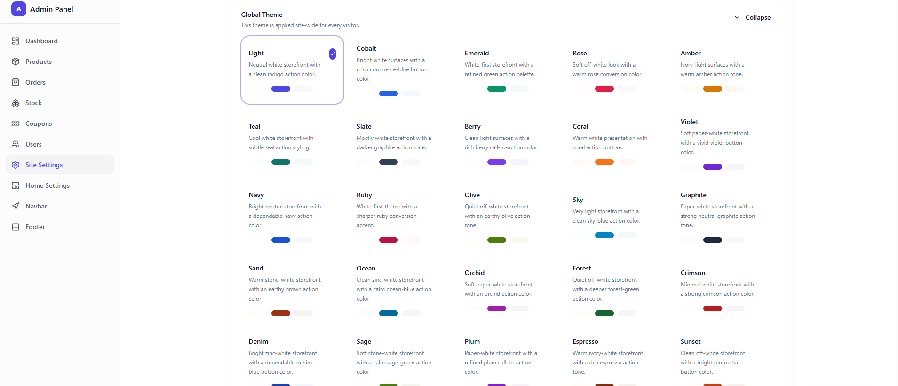

# Fully Dynamic E-Commerce Website

A modern, full-stack e-commerce platform built with Next.js (frontend) and NestJS (backend). This application features a fully dynamic website where admins can manage products, orders, coupons, and website content (navbar, footer, homepage sections) from an intuitive admin dashboard.

---

## Screenshots

### Admin Dashboard



### Product Details



### Product Details Card



### Product Filter



### Checkout



### Order Management



### Stock Management



### Theme Control



## ▶️ [Demo Video](https://www.loom.com/share/5bf79d137913468aa525f4d092e42197)

## Key Features

### Dynamic Content Management (Admin-Controlled)

- **Dynamic Homepage**: Fully customizable homepage with draggable sections (hero slider, featured products, banners, etc.)
- **Dynamic Navbar**: Admin can add, remove, and reorder navigation menu items
- **Dynamic Footer**: Customizable footer content including columns and links
- **Site Settings**: Configure logo, favicon, title, meta tags, and SEO settings

### Product Management

- **Simple & Variable Products**: Support for simple products and products with multiple variants (size, color, etc.)
- **Rich Text Descriptions**: Full rich text editor (Tiptap) for product descriptions
- **Product Images**: Multiple image uploads with gallery support
- **Product Flags**: Mark products as new, featured, on sale, etc.
- **Advanced Search & Filter**: Search by name, filter by category, price range, variants
- **Stock Tracking**: Real-time inventory management

### Shopping Experience

- **Shopping Cart**: Persistent cart (saved for authenticated users)
- **Guest Checkout**: Checkout without account registration
- **Coupon System**: Apply percentage or fixed discount codes
- **Multiple Payment Methods**: Support for bKash and Cash on Delivery

### User Management

- **User Registration**: Sign up with email/phone
- **User Login**: Secure JWT-based authentication
- **Profile Management**: View and edit profile information
- **Password Change**: Authenticated users can change passwords
- **Order History**: View past orders and tracking

### Admin Dashboard

- **Dashboard Overview**: Store statistics and quick actions
- **Product Management**: Create, edit, delete products
- **Order Management**: View, confirm, and cancel orders
- **User Management**: View and manage registered users
- **Coupon Management**: Create discount codes with usage limits
- **Stock Reports**: View inventory health and sales analytics
- **Website Settings**: Manage all dynamic content

### UI/UX Features

- **Responsive Design**: Mobile-friendly interface
- **Dark/Light Mode**: Theme switching
- **Modern Components**: Built with shadcn/ui
- **Data Visualization**: Charts and analytics
- **Toast Notifications**: Real-time feedback

---

## 🚀 How to Run

### Prerequisites

- **Node.js** (v18 or higher)
- **PostgreSQL** database
- **MinIO** (optional - for image storage, can use any S3-compatible storage)

### Backend Setup

1. Navigate to the backend directory:

   ```bash
   cd backend
   ```

2. Install dependencies:

   ```bash
   npm install
   ```

3. Create a `.env` file in the `backend` directory (see Environment Variables section below).

4. Start the development server:

   ```bash
   npm run start:dev
   ```

   The backend will run on `http://localhost:4000` by default.

### Frontend Setup

1. Navigate to the frontend directory:

   ```bash
   cd frontend
   ```

2. Install dependencies:

   ```bash
   npm install
   ```

3. Start the development server:

   ```bash
   npm run dev
   ```

   The frontend will run on `http://localhost:3000` by default.

---

## 🔐 Environment Variables

### Backend (.env)

Create a `.env` file in the `backend` directory with the following variables:

| Variable           | Description                                              | Required |
| ------------------ | -------------------------------------------------------- | -------- |
| `DB_HOST`          | PostgreSQL database host                                 | Yes      |
| `DB_PORT`          | PostgreSQL database port (default: 5432)                 | Yes      |
| `DB_USERNAME`      | PostgreSQL username                                      | Yes      |
| `DB_PASSWORD`      | PostgreSQL password                                      | Yes      |
| `DB_NAME`          | PostgreSQL database name                                 | Yes      |
| `DB_SYNCHRONIZE`   | Enable TypeORM auto-sync (set to 'true' for development) | Yes      |
| `ACCESS_TOKEN`     | Secret key for JWT token generation                      | Yes      |
| `PORT`             | Server port (default: 4000)                              | No       |
| `NODE_ENV`         | Environment mode (development/production)                | No       |
| `ENABLE_SWAGGER`   | Enable Swagger API documentation                         | No       |
| `MINIO_URL`        | MinIO/S3 endpoint URL                                    | No\*     |
| `MINIO_ACCESS_KEY` | MinIO access key                                         | No\*     |
| `MINIO_SECRET_KEY` | MinIO secret key                                         | No\*     |
| `MINIO_BUCKET`     | MinIO bucket name                                        | No\*     |
| `MINIO_PUBLIC_URL` | Public URL for accessing uploaded files                  | No\*     |

\*MinIO variables are optional. If not provided, image upload functionality will be disabled but the rest of the application will work.

### Frontend (.env)

Create a `.env` file in the `frontend` directory:

| Variable              | Description                                      | Required |
| --------------------- | ------------------------------------------------ | -------- |
| `NEXT_PUBLIC_API_URL` | Backend API URL (default: http://localhost:4000) | Yes      |

---

## 📋 Features (Detailed)

### Backend Features

#### 1. User Management

- **User Registration**: Sign up with email/phone and password (passwords are bcrypt-hashed)
- **User Login**: Unified login by email or phone number
- **Profile Management**: Get and update user profile information
- **Password Change**: Authenticated users can change their password
- **Admin User Management**: Admin can query, update, and delete users

#### 2. Product Management

- **Create Products**: Create products with variants or simple products
- **Product Variants**: Support for multiple variants (size, color, etc.)
- **Rich Text Description**: Full rich text product descriptions
- **Product Images**: Image management for products
- **Product Flags**: Mark products as new, featured, on sale, etc.
- **Search & Filter**: Advanced search and filtering capabilities
- **Stock Management**: Track inventory levels
- **Stock Reports**: Admin can view inventory health, best sellers, and sales analytics

#### 3. Shopping Cart

- **Add to Cart**: Add products or product variants to cart
- **Update Quantity**: Modify item quantities in cart
- **Remove Items**: Delete individual items or clear entire cart
- **Persistent Cart**: Cart data is stored in database for authenticated users

#### 4. Checkout & Orders

- **Guest Checkout**: Support for checkout without login
- **Authenticated Checkout**: Link orders to user accounts
- **Order Management**: View order history and status
- **Order Status**: Admin can confirm or cancel orders
- **Stock Restoration**: Cancelled orders restore reserved stock

#### 5. Coupon System

- **Create Coupons**: Admin can create discount coupons
- **Coupon Types**: Support for percentage and fixed discounts
- **Coupon Preview**: Preview coupon discount before checkout
- **Usage Limits**: Control coupon usage limits and expiration

#### 6. Image Upload

- **Admin Image Upload**: Upload product images (admin only)
- **Avatar Upload**: Users can upload profile avatars
- **File Validation**: Supports jpg, png, webp, gif, svg, avif (max 8MB)
- **MinIO/S3 Storage**: Uses MinIO for file storage (S3-compatible)

#### 7. Website Settings (Dynamic Content)

- **Site Settings**: Logo, favicon, title, meta tags configuration
- **Navbar Settings**: Customizable navigation menu
- **Footer Settings**: Customizable footer content
- **Homepage Settings**: Dynamic homepage sections (hero slider, product sections, banners)
- **Page-Specific Settings**: Different content for different pages

#### 8. Security & Performance

- **JWT Authentication**: Secure token-based authentication
- **Role-Based Access Control**: Admin and user roles
- **Input Validation**: Class-validator for request validation
- **Rate Limiting**: Throttle requests for security
- **XSS Protection**: Express sanitizer for security
- **CORS Enabled**: Cross-origin resource sharing
- **Compression**: Gzip compression for performance
- **Helmet**: Security headers

#### 9. API Documentation

- **Swagger UI**: Interactive API documentation (when enabled)

---

### Frontend Features

#### 1. Public Storefront

- **Homepage**: Dynamic homepage with hero sections and product displays
- **Product Listing**: Browse products with search and filters
- **Product Details**: Detailed product pages with variants
- **Search**: Product search functionality
- **Category Pages**: Dynamic category navigation

#### 2. User Features

- **User Registration**: Sign up for new accounts
- **User Login**: Secure login functionality
- **User Profile**: View and edit profile information
- **Order History**: View past orders and their status
- **Password Management**: Change account password

#### 3. Shopping

- **Shopping Cart**: Add/remove products, update quantities
- **Checkout**: Complete purchase flow
- **Coupon Application**: Apply discount codes at checkout

#### 4. Admin Dashboard

- **Dashboard Overview**: Overview of store statistics
- **Product Management**: Create, edit, and delete products
- **Order Management**: View and manage customer orders
- **User Management**: View and manage users
- **Coupon Management**: Create and manage discount coupons
- **Stock Management**: View stock reports and inventory
- **Website Settings**:
  - Site settings (logo, favicon, meta)
  - Navbar configuration
  - Footer configuration
  - Homepage content management

#### 5. UI/UX

- **Modern Design**: Clean, responsive interface using shadcn/ui
- **Rich Text Editor**: Tiptap editor for product descriptions
- **Data Visualization**: Charts and graphs for analytics
- **Real-time Feedback**: Toast notifications for actions
- **Dark/Light Mode**: Theme switching support

---

## 🏗️ Tech Stack

### Backend

- **Framework**: NestJS
- **Database**: PostgreSQL with TypeORM
- **Authentication**: JWT (JSON Web Tokens)
- **Validation**: class-validator & class-transformer
- **File Storage**: MinIO (S3-compatible)
- **API Documentation**: Swagger/OpenAPI

### Frontend

- **Framework**: Next.js 16 (React 19)
- **UI Components**: shadcn/ui
- **State Management**: Zustand
- **Data Fetching**: TanStack React Query
- **Rich Text Editor**: Tiptap
- **Charts**: Recharts
- **Styling**: Tailwind CSS

---

## 📁 Project Structure

```
fully-dynaimc-e-commer-website/
├── backend/
│   ├── src/
│   │   ├── image/          # Image upload module
│   │   ├── product/        # Product, cart, checkout, coupon modules
│   │   ├── user/           # User management module
│   │   ├── web-settings/   # Dynamic website settings module
│   │   ├── app.module.ts   # Main application module
│   │   └── main.ts         # Application entry point
│   └── lib/                # Shared utilities and guards
├── frontend/
│   ├── src/
│   │   ├── app/           # Next.js app router pages
│   │   ├── actions/       # Server actions
│   │   ├── api-hooks/     # React Query hooks
│   │   └── @types/        # TypeScript type definitions
│   └── public/            # Static assets
├── images/                 # Project screenshots
└── README.md              # This file
```

---

## 📄 License

Private - All rights reserved
